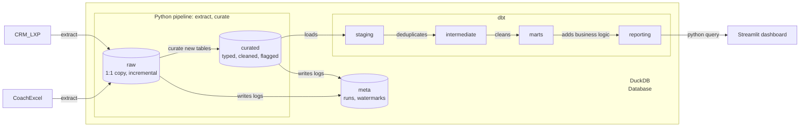
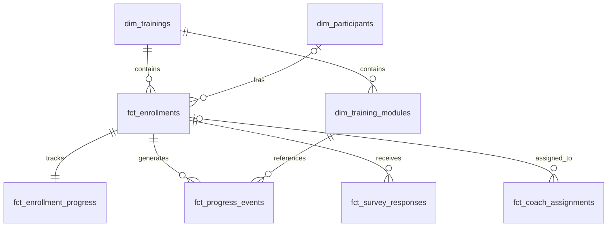

# Stackfuel Training Operations KPI Pipeline
**Owner:** Nikolas Artadi | **Contact:** nikolas@artadini.eu | **Last updated:** 2026-10-06

An end-to-end analytics pipeline that combines Stackfuel’s CRM, learning-platform API, and coach Excel workbook into five tested training-operations KPIs and a Streamlit dashboard.

The pipeline is designed for unreliable and inconsistent operational data: sources have no shared key, APIs can fail or return incomplete pages, and the coach data is manually maintained.

## Headline results and deliverables

- **Active workload:** 159 active enrollments; 36 are past their planned end date.
- **Outcomes:** Of 498 eligible enrollments, 353 completed and 88 were abandoned: 71% completion and 18% abandonment.
- **Progress risk:** Active enrollments completed 45% of the curriculum while 54% of planned time had elapsed. 61 of 159 enrollments, or 38%, were at least 15 percentage points behind schedule.
- **Learner feedback:** Pooled NPS declined from 15.1 in Q1–Q3 2025 to 12.6 in Q1–Q3 2026.
- **Coach coverage:** 166 of 187 active or paused enrollments had a confident coach match. 21 had no confident assignment.

“Abandoned” is the source status used as the dropout proxy.

### Detailed results & tables

The five questions are answered in the generated report:

>Running `make demo` generates the results report and CSV files locally.

- [All five results](dbt/reports/results.md) or see [section 3. Results from README_long](README_long.md)
- [Q2: Completion and abandonment](dbt/reports/q2_completion_abandonment_by_training_funding.csv)
- [Q3: Progress versus time](dbt/reports/q3_progress_vs_time.csv)
- [Q4: NPS by training and quarter](dbt/reports/q4_nps_by_training_quarter.csv)
- Q1 and Q5 are included in `dbt/reports/results.md` and the dashboard.

The source queries are in [`dbt/analyses/`](dbt/analyses/).

All results use a data cutoff of **31 August 2026**. Enrollments are the main unit of analysis.


## Usage of AI

Perplexity supported research and technical validation, while GitHub Copilot and Warp Oz AI assisted with coding and refinement.

The tools were used incrementally within a pre-designed pipeline. Their outputs required continuous steering, domain knowledge, and manual review to ensure they reflected the business context and were reliable for decision-making. These tools sometimes hallucinate or drift from the agreed design, so every output was reviewed against the design and the source data.

Metadata, logging, and explicit error handling supported validation throughout development. The written extraction, raw and curated layers were checked against the source files.

## Quick start

Requirements: `make` and Python 3.12+. Docker is optional.

```bash
make setup       # Run once
make demo        # Run the API, pipeline, dbt, tests, and reports
make dashboard   # Optional: http://localhost:8501
```

A successful run should produce:

```text
raw_loaded=6/6 raw_failed=[]
```

Results are written to:

```text
dbt/reports/results.md
```

The pipeline is safe to rerun. Same-day raw and curated tables are replaced; earlier snapshots are retained. Exit code `0` means success, `1` failure, and `2` partial success.

## Architecture
- **Raw:** preserves source records as text for traceability and replay.
- **Curated:** standardizes, types, validates, and flags records.
- **Staging:** unions snapshots and deduplicates records.
- **Intermediate:** applies progress, NPS, and coach-matching logic.
- **Marts:** provide a privacy-filtered analytical model.
- **Reporting:** produces the five tested KPI outputs.


## Assumptions and definitions

- **KPI cutoff:** 31 August 2026. Records through this date are included.
- **Unit of analysis:** enrollments, not necessarily distinct people. Source participant IDs remain authoritative; participants are not merged by e-mail.
- **Active enrollment:** an enrollment whose source status is active at the cutoff.
- **Eligible enrollment for Q2:** an enrollment whose planned end date is before the cutoff.
- **Completion:** source status `completed`.
- **Abandonment:** source status `abandoned`, used as the dropout proxy.
- **Behind schedule:** curriculum progress is at least 15 percentage points below elapsed planned time.
- **NPS:** promoters are scores 9–10, passives 7–8, and detractors 0–6. Empty answers are excluded.
- **Coach assignment:** only confident, non-ambiguous matches are counted.
- **Time zones:** source timestamps are normalized to UTC in the curated layer.
- **Missing references:** enrollments with missing participants remain visible and use `funding_type = 'unknown'`.

## Five design decisions

| # | Design decision | Approach | Benefit | Trade-off / result |
|---:|---|---|---|---|
| 1 | Preserve raw data | Store a 1:1 copy of each source for every snapshot day. | Every result can be traced back to the source. | Higher storage use. |
| 2 | Load incrementally | Use high watermarks such as `modified_at` and `event_time` for API sources. Fingerprint sources without change filters using SHA-256. | Efficient daily loads and reruns. | Source-side hard deletes are not detected. |
| 3 | Flag instead of silently dropping | Preserve original values, apply types and UTC timestamps, and add quality flags and validation status in the curated layer. | Bad records remain visible for investigation. | Downstream models must handle flagged records. |
| 4 | Never guess coach matches | Match by unique e-mail, then name + training + cohort, then name + training when exactly one match exists. Leave ambiguous rows unmatched. | Avoids misleading workload metrics. | 21 enrollments have no confident coach assignment. |
| 5 | Fail loudly | Fail the affected dataset on incomplete pagination, schema changes, or unexpectedly small extracts. Preserve previous successful tables and prevent downstream reporting after an unsuccessful run. | Prevents incomplete data from becoming published KPIs. | Production still needs operational monitoring. |

### Data model

The model keeps participant, training, progress, survey, and coach-assignment concerns separate to prevent join multiplication and preserve clear grains.

The analytical model is centered on enrollments:



## Data quality

| Finding | Count | Handling |
|---|---:|---|
| API failures, token expiry, and pagination issues | Approximately 4% of calls | Retries, token refresh, and `total_count` validation; incomplete reads fail the dataset |
| Duplicate progress events | 222 rows | Flagged in curated and deterministically deduplicated in staging |
| Missing participants | 6 enrollments | Kept with `funding_type = 'unknown'`; relationship test warns |
| Active enrollments past planned end | 36 | Kept and flagged; time progress capped at 100% |
| Inconsistent status values | 24 enrollments | Standardized; original values preserved |
| Multiple participant IDs with the same e-mail | 18 e-mails / 36 rows | E-mail used only as a matching hint; IDs remain authoritative |
| Coach training-name variants | 33 variants | Mapped to canonical training IDs |
| Ambiguous coach matches | 38 rows | Retained but never force-matched |
| Hard deletes | Not detected | Requires periodic full-read comparison or a change feed |

## Testing

- **242 Python tests:** pagination, retries, token refresh, watermarks, reruns, failures, schema enforcement, typing, UTC conversion, and quality flags.
- **145 dbt tests:** structural tests, relationship checks, business rules, NPS validation, join-safety checks, and staging guards.
- **Idempotency:** a second dbt build produces identical tables.

## Production readiness

The pipeline already provides idempotent reruns, run logging, watermarks, exit codes, source guards, and transactional writes.

Before production deployment, it needs:

- An orchestrator with retries, backfills, and alerts.
- Monitoring for freshness, volume, and quality changes.
- CI for Python, dbt, SQL, and data contracts.
- A shared warehouse and secret manager.
- Hard-delete detection.
- A structured coach system instead of the Excel workbook.

## Reference

- [Complete documentation](README_long.md)
- `dbt/reports/results.md` — generated KPI report
- `dbt/reports/` — generated SQL and CSV outputs
- `pipeline.py` — pipeline entry point
- `pipeline_functions/` — extraction and curation code
- `dbt/models/` — transformation and reporting models