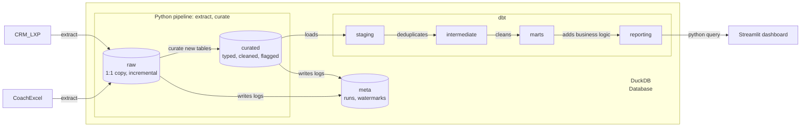
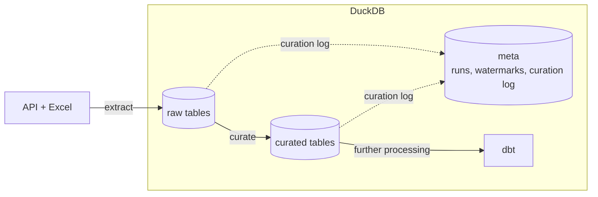
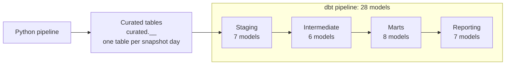
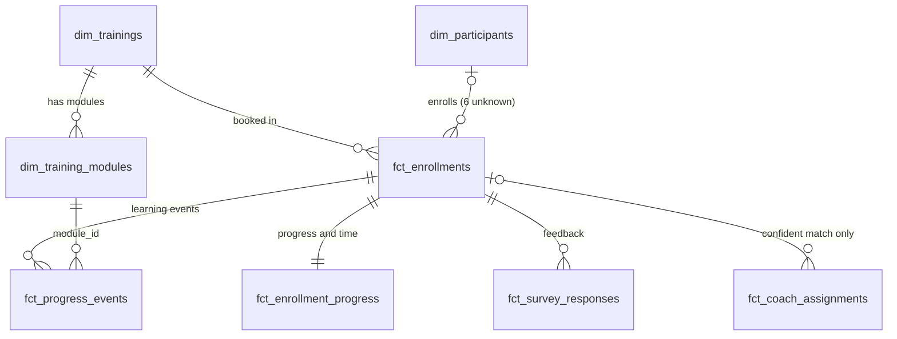
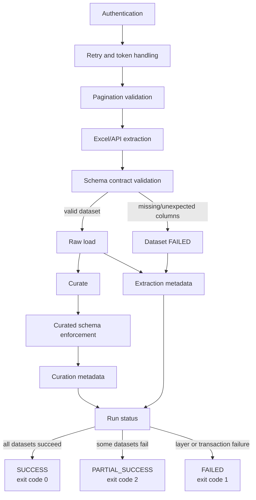

# Stackfuel Training Operations KPI Pipeline

**Owner:** Nikolas Artadi | **Contact:** nikolas@artadini.eu | **Last updated:** 2026-10-06

Built an end-to-end analytics pipeline that combines data from Stackfuel’s CRM, learning platform API, and manually maintained coach Excel file into a tested, reproducible DuckDB model and weekly KPI report.

The pipeline must handle pagination, authentication, API failures, inconsistent data, duplicates, broken references, and linking coaches to participants without a shared key. It should answer five business questions on enrollments, completion and abandonment, curriculum progress, NPS, and coach workloads.

The project includes Python extraction and cleaning, dbt transformations, KPI queries, and a Streamlit dashboard. Nothing is pre-loaded: one command rebuilds everything from the source data.

## Architecture and data flow


## Contents

1. [Introduction and approach](#1-introduction-and-approach)
2. [Quick start](#2-quick-start)
3. [Results](#3-results)
4. [Architecture and technologies](#4-architecture-and-technologies)
5. [Data lifecycle](#5-data-lifecycle)
6. [Python pipeline](#6-python-pipeline)
7. [dbt pipeline](#7-dbt-pipeline)
8. [Dashboard](#8-dashboard)
9. [To run in production and future improvements](#9-to-run-in-production-and-future-improvements)
10. [Testing strategy](#10-testing-strategy)
11. [Assumptions and definitions](#11-assumptions-and-definitions)

## 1. Introduction and approach

This pipeline answers five recurring business questions for Stackfuel’s Training Operations team. Data from the CRM, learning platform, and coach Excel file is extracted, preserved, cleaned, modeled, and transformed into tested tables and a reproducible dashboard.

### How this project was built:

1. Documentation was reviewed and the available datasets were explored using Excel, pandas, and direct inspection of the API’s JSON structures.
2. Each source was documented separately, with data-quality issues identified and logged explicitly.
3. A layered architecture was designed for extraction, raw data preservation, cleaning, analytical modeling, and reporting.
4. A dbt star schema centered on enrollments was designed to answer the five business questions.
5. Functional and non-functional requirements were defined, including idempotency, incremental loading, and failure handling.
6. The Python pipeline was built layer by layer, with GitHub Copilot and Warp Oz AI supporting implementation. The extraction and load code was written around explicit rules: raw as a 1:1 incremental copy of the sources, curated as typed and flagged tables, everything stored inside DuckDB.
7. Warp was used to refine the dbt project, pipeline, and dashboard, with manual review throughout.
8. Results were corroborated across the codebase and against the source data.

### Usage of AI

Perplexity supported research and technical validation, while GitHub Copilot and Warp Oz AI assisted with coding and refinement.

The tools were used incrementally within a pre-designed pipeline. Their outputs required continuous steering, domain knowledge, and manual review to ensure they reflected the business context and were reliable for decision-making. These tools sometimes hallucinate or drift from the agreed design, so every output was reviewed against the design and the source data.

Metadata, logging, and explicit error handling supported validation throughout development. The written extraction, raw and curated layers were checked against the source files.

[Back to content](#contents)

## 2. Quick start

### Prerequisites

- `make` and Python 3.12 or newer (developed on 3.14, macOS). Docker is optional.
- Python packages of the pipeline (`requirements.txt`): `duckdb`, `openpyxl`, `pyarrow`, `pytz`, `tzdata`.
- The bundled test API uses the assignment login by default (`stackfuel` / `learn-data-2026`); override it with the environment variables `API_USERNAME` and `API_PASSWORD`.

### Run it

```bash
make setup       # once: creates three small virtual environments
make demo        # starts the test API, runs the pipeline, builds and tests dbt, exports the results (under a minute)
make dashboard   # optional: http://localhost:8501
```

`make demo` stops the API afterwards, even if a step fails. If the pipeline does not finish as `SUCCESS` (exit code 1 = failed, 2 = partial success), dbt and the reports are skipped, so no report is built on an incomplete load. It is safe to rerun: a rerun on the same day replaces that day's raw and curated tables, earlier days are kept, and a second dbt build gives identical tables. Close other programs that use `db/duckdb/stackfuel.duckdb` (a DuckDB shell, an IDE dbt extension, the dashboard) first, because DuckDB allows only one writer. If port 8000 is already taken, use `make demo LOCAL_API_PORT=8012`.

<details>
<summary>Without make</summary>

```bash
python api/server.py --port 8000
API_BASE_URL=http://127.0.0.1:8000 python pipeline.py
cd dbt && DBT_PROFILES_DIR=. dbt build
```

Options of the Python pipeline (each also exists as an environment variable):

```bash
python pipeline.py                              # extract into raw, then curate (default)
python pipeline.py --layer raw                  # only extract
python pipeline.py --layer curated              # only curate raw tables that are not curated yet
python pipeline.py --full-refresh               # ignore watermarks and fingerprints, read everything
python pipeline.py --rebuild-curated            # curate every raw table again
python pipeline.py --snapshot-date 2026-09-02   # date part of the table names (backfills, tests)
python pipeline.py --allow-shrinking-source     # accept a complete read that returns far fewer records than are stored
```
</details>

<details>
<summary>More commands</summary>

| Command | Purpose |
|---|---|
| `make pipeline-local` / `make run` | pipeline only (API already running) / API and pipeline in Docker |
| `make db-flush` | delete the DuckDB database; the next run rebuilds everything from the sources |
| `make dbt-build`, `make dbt-test` | build dbt models and tests / tests only |
| `make dbt-full-refresh` | rebuild the incremental dbt models from the complete history |
| `make dbt-results` | run the five question queries and export SQL, CSV and Markdown to `dbt/reports/` |
| `make dbt-rerun-check` | prove that a second build changes nothing |
| `make dbt-incremental-check` | incremental output equals a full refresh (on a scratch copy; still has to be adapted to the new table layout, see section 7) |
| `make test`, `make pytest`, `make docs` | pytest plus dbt tests / pytest only / generate dbt documentation |
| `make dbt-docs-serve` | serve dbt documentation locally for browsing |

### Viewing dbt documentation

After running `make docs` (or `make dbt-docs-serve` if available), you can open the dbt documentation site to inspect:

- Model descriptions and grain ("one row per ...").
- Column descriptions and tests.
- Lineage graph showing the complete data lifecycle from sources through reporting.
- Source declarations and test coverage.

If `make dbt-docs-serve` is not defined, run:

```bash
cd dbt && DBT_PROFILES_DIR=. dbt docs generate
dbt docs serve
```

Then open the URL shown in your browser (typically `http://localhost:8080`).

</details>

[Back to content](#contents)

## 3. Results

KPI cutoff 31.08.2026* Generated by `make dbt-results`; queries are in `dbt/analyses/`, the executed SQL, CSV files and a combined `results.md` are in `dbt/reports/`.

Questions translated with DeepL.com.

### Q1: Active enrollments per training

Question:
- Active Participants: How many participants are active as of the cutoff date—per training session?

Answer: 159 participants.

<details>
<summary>Table</summary>

| Training | Active | Of which past planned end |
|---|---:|---:|
| T01 Data Analyst – Vollzeit | 46 | 13 |
| T02 Data Analyst – Teilzeit | 22 | 3 |
| T03 Data Scientist – Vollzeit | 28 | 8 |
| T04 Data Scientist – Teilzeit | 15 | 0 |
| T05 Data Engineer – Vollzeit | 26 | 4 |
| T06 Python für Data Analytics – Berufsbegleitend | 11 | 2 |
| T07 KI & Machine Learning Grundlagen – Berufsbegleitend | 5 | 1 |
| T08 Business Intelligence mit Power BI – Vollzeit | 6 | 5 |
| **Total** | **159** | **36** |

</details>

### Q2: Completion and abandonment

Question:
- Completion and Dropout Rates: For participants whose scheduled end date is before the cutoff date: What percentage have completed the training, and what percentage have dropped out—per training session and funding type (`funding_type`)?

Answer:
- 71% completion and 18% dropout rates (353 completed and 88 abandoned of 498 eligible enrollments). Enrollments with planned end before the cutoff. Shares use all eligible enrollments as the denominator; other statuses stay visible.

<details>
<summary>Table</summary>

| Training | Training Name | Funding Type | Eligible Enrollment Count | Completed Count | Abandoned Count | Other Status Count | Completed Share | Abandoned Share |
|---|---|---|---|---|---|---|---|---|
| T01 | Data Analyst – Vollzeit | bildungsgutschein | 87 | 58 | 19 | 10 | 66.67% | 21.84% |
| T01 | Data Analyst – Vollzeit | firmenkunde | 21 | 15 | 3 | 3 | 71.43% | 14.29% |
| T01 | Data Analyst – Vollzeit | selbstzahler | 22 | 14 | 4 | 4 | 63.64% | 18.18% |
| T02 | Data Analyst – Teilzeit | bildungsgutschein | 40 | 29 | 7 | 4 | 72.50% | 17.50% |
| T02 | Data Analyst – Teilzeit | firmenkunde | 5 | 3 | 1 | 1 | 60% | 20% |
| T02 | Data Analyst – Teilzeit | selbstzahler | 7 | 4 | 1 | 2 | 57.14% | 14.29% |
| T03 | Data Scientist – Vollzeit | bildungsgutschein | 64 | 45 | 11 | 8 | 70.31% | 17.19% |
| T03 | Data Scientist – Vollzeit | firmenkunde | 15 | 8 | 5 | 2 | 53.33% | 33.33% |
| T03 | Data Scientist – Vollzeit | selbstzahler | 12 | 9 | 3 | 0 | 75% | 25% |
| T03 | Data Scientist – Vollzeit | unknown | 1 | 1 | 0 | 0 | 100% | 0% |
| T04 | Data Scientist – Teilzeit | bildungsgutschein | 19 | 15 | 3 | 1 | 78.95% | 15.79% |
| T04 | Data Scientist – Teilzeit | firmenkunde | 2 | 2 | 0 | 0 | 100% | 0% |
| T04 | Data Scientist – Teilzeit | selbstzahler | 2 | 2 | 0 | 0 | 100% | 0% |
| T05 | Data Engineer – Vollzeit | bildungsgutschein | 43 | 31 | 8 | 4 | 72.09% | 18.60% |
| T05 | Data Engineer – Vollzeit | firmenkunde | 7 | 6 | 0 | 1 | 85.71% | 0% |
| T05 | Data Engineer – Vollzeit | selbstzahler | 6 | 4 | 2 | 0 | 66.67% | 33.33% |
| T06 | Python für Data Analytics – Berufsbegleitend | bildungsgutschein | 33 | 23 | 6 | 4 | 69.70% | 18.18% |
| T06 | Python für Data Analytics – Berufsbegleitend | firmenkunde | 8 | 5 | 2 | 1 | 62.50% | 25% |
| T06 | Python für Data Analytics – Berufsbegleitend | selbstzahler | 9 | 8 | 0 | 1 | 88.89% | 0% |
| T07 | KI & Machine Learning Grundlagen – Berufsbegleitend | bildungsgutschein | 21 | 18 | 2 | 1 | 85.71% | 9.52% |
| T07 | KI & Machine Learning Grundlagen – Berufsbegleitend | firmenkunde | 4 | 2 | 0 | 2 | 50% | 0% |
| T07 | KI & Machine Learning Grundlagen – Berufsbegleitend | selbstzahler | 3 | 2 | 1 | 0 | 66.67% | 33.33% |
| T07 | KI & Machine Learning Grundlagen – Berufsbegleitend | unknown | 1 | 1 | 0 | 0 | 100% | 0% |
| T08 | Business Intelligence mit Power BI – Vollzeit | bildungsgutschein | 40 | 31 | 5 | 4 | 77.50% | 12.50% |
| T08 | Business Intelligence mit Power BI – Vollzeit | firmenkunde | 13 | 9 | 2 | 2 | 69.23% | 15.38% |
| T08 | Business Intelligence mit Power BI – Vollzeit | selbstzahler | 12 | 7 | 3 | 2 | 58.33% | 25% |
| T08 | Business Intelligence mit Power BI – Vollzeit | unknown | 1 | 1 | 0 | 0 | 100% | 0% |

</details>

### Q3: Learning progress vs. elapsed time

Question:
- Learning Progress vs. Time Progress: For active enrollments: How far have participants progressed through the curriculum (percentage of completed modules) compared to how much of the planned training duration has already elapsed? What percentage is at least 15 percentage points behind schedule (“behind schedule”)?

Answer:
- For active enrollments, participants have completed 45% of the curriculum on average, while 54% of the planned training time has elapsed. This means learning progress is 9% behind time progress overall.

- Overall, 38% of active enrollments are at least 15 percentage points behind schedule—61 out of 159 participants.
- Highest risk behind schedule:

| Training | Behind %|
| --- | ---: |
| T08 Business Intelligence mit Power BI – Vollzeit | 68% |
| T07 KI & Machine Learning Grundlagen – Berufsbegleitend | 60% |
| T03 Data Scientist – Vollzeit | 50% |

<details>
<summary>Table</summary>

| Training | Active | Behind | Behind % | Avg. progress | Avg. time elapsed |
|---|---:|---:|---:|---:|---:|
| T01 Data Analyst – Vollzeit | 46 | 17 | 37.0% | 46.7% | 56.5% |
| T02 Data Analyst – Teilzeit | 22 | 8 | 36.4% | 29.5% | 35.2% |
| T03 Data Scientist – Vollzeit | 28 | 14 | 50.0% | 44.6% | 57.9% |
| T04 Data Scientist – Teilzeit | 15 | 3 | 20.0% | 46.7% | 49.3% |
| T05 Data Engineer – Vollzeit | 26 | 9 | 34.6% | 43.6% | 53.1% |
| T06 Python für Data Analytics – Berufsbegleitend | 11 | 3 | 27.3% | 54.5% | 59.1% |
| T07 KI & Machine Learning Grundlagen – Berufsbegleitend | 5 | 3 | 60.0% | 28.0% | 40.0% |
| T08 Business Intelligence mit Power BI – Vollzeit | 6 | 4 | 66.7% | 77.8% | 91.7% |
| All trainings | 159 | 61 | 38.4% | 44.6% | 53.5% |

</details>

### Q4: NPS per training and quarter

Question: What is the Net Promoter Score (promoters 9–10 minus detractors 0–6, as a percentage) from the final feedback, by training and quarter?

Answer (Q1–Q3 2025 vs. Q1–Q3 2026, pooled NPS):

- Overall NPS fell slightly, by 2.5 points, from 15.1 to 12.6 points
- NPS fell despite more positive trainings, because the promoter share only rose by 8%, while the detractor increased sharply by 24%
- The 2026 responses is larger (135 responses vs. 119, +13%), more trainings scored positive in 2026 (6 of 8) than in 2025 (5 of 8)
- Response volume: T02 grew the most (7 → 19) and T04 more than doubled (4 → 10), T01 (33 → 28) and T05 (18 → 15) had fewer responses

> Considerations of analysis:
> - Promoters 9–10, passives 7–8, detractors 0–6; NPS = 100 × (promoters − detractors) / valid answers
> - Pooled NPS sums promoters, detractors and responses across Q1–Q3 of each year. It is not an average of quarterly scores
> - Quarter = UTC quarter of the submission; 2026-Q3 is partial
> - Only completion (final) feedback is included
> - Valid answers (n) are shown in brackets; single answers move small cells a lot
> - Small sample sizes skew results
> - Values are rounded to one decimal

<details>
<summary>Per quarter</summary>

| Training | 2024-Q4 (n) | 2025-Q1 (n) | 2025-Q2 (n) | 2025-Q3 (n) | 2025-Q4 (n) | 2026-Q1 (n) | 2026-Q2 (n) | 2026-Q3 (n) |
|---|---|---|---|---|---|---|---|---|
| T01 Data Analyst – Vollzeit | +0 (2) | +38 (13) | +33 (9) | +18 (11) | +50 (16) | +62 (8) | -10 (10) | +30 (10) |
| T02 Data Analyst – Teilzeit | - | - | +33 (3) | +25 (4) | +0 (11) | +44 (9) | -17 (6) | +50 (4) |
| T03 Data Scientist – Vollzeit | -100 (1) | -33 (6) | -10 (10) | +12 (8) | +27 (11) | +38 (8) | +38 (8) | -14 (7) |
| T04 Data Scientist – Teilzeit | - | - | -100 (1) | -33 (3) | -14 (7) | -100 (3) | -100 (4) | +67 (3) |
| T05 Data Engineer – Vollzeit | -100 (1) | +17 (6) | +71 (7) | +20 (5) | +62 (8) | +17 (6) | +0 (2) | +14 (7) |
| T06 Python für Data Analytics – Berufsbegleitend | +100 (2) | +0 (1) | +0 (9) | +100 (2) | +75 (4) | +43 (7) | +33 (6) | +0 (4) |
| T07 KI & Machine Learning Grundlagen – Berufsbegleitend | -100 (1) | +0 (7) | +33 (3) | -100 (1) | +50 (2) | +0 (4) | +33 (3) | -75 (4) |
| T08 Business Intelligence mit Power BI – Vollzeit | +0 (11) | +0 (5) | -100 (1) | +50 (4) | +25 (8) | +0 (5) | -33 (3) | +50 (4) |
| Total response average pts | -33.3 |	3.6 | -4.8 |	11.6 |	34.4 |	13.0 |	-7.0 |	15.2 |
| Total responses sum (n) | 18 | 38 | 43 | 38 | 67 | 50 | 42 | 43 |

</details>

<details>
<summary>Further analysis</summary>

- Improved: T03 gained the most points (+30.1, from −8.3 to +21.7) and is the reason the positive count rose. T06 also rose (+12.7)
- Declined: T05 (−25.6) and T07 (−18.2) dropped the most points, T04 slipped further into negative territory (−10.0)
- Roughly flat: T01, T02 and T08 moved by less than 6 points

| Training | NPS 2025 (n) | NPS 2026 (n) | Change (pts) |
|---|---:|---:|---:|
| T01 Data Analyst – Vollzeit | +30.3 (33) | +25.0 (28) | −5.3 |
| T02 Data Analyst – Teilzeit | +28.6 (7) | +26.3 (19) | −2.3 |
| T03 Data Scientist – Vollzeit | −8.3 (24) | +21.7 (23) | +30.1 |
| T04 Data Scientist – Teilzeit | −50.0 (4) | −60.0 (10) | −10.0 |
| T05 Data Engineer – Vollzeit | +38.9 (18) | +13.3 (15) | −25.6 |
| T06 Python für Data Analytics – Berufsbegleitend | +16.7 (12) | +29.4 (17) | +12.7 |
| T07 KI & Machine Learning Grundlagen – Berufsbegleitend | 0.0 (11) | −18.2 (11) | −18.2 |
| T08 Business Intelligence mit Power BI – Vollzeit | +10.0 (10) | +8.3 (12) | −1.7 |
| All trainings | +15.1 (119) | +12.6 (135) | −2.5 |

</details>


### Q5: Coach utilization

Question:
- **Coach workload:** How many active or paused participations does each coach oversee according to the supervision list, and how many of these are marked **red**? How many participations were you unable to assign to a coach?

Answer:
- Of 187 active or paused enrollments:
  - 89% (166) have a confident coach assignment
  - 11% (21) have none
- 38 ambiguous workbook rows are never force-matched or counted as assigned

<details>
<summary>Table</summary>

| Coach | Active or paused | Red | Ambiguous rows |
|---|---:|---:|---:|
| Daniel Brandt | 29 | 6 | 6 |
| Elif Kaya | 25 | 8 | 8 |
| Jonas Petersen | 28 | 5 | 6 |
| Miriam Vogt | 27 | 3 | 2 |
| Sarah Kowalski | 29 | 3 | 12 |
| Tobias Lindner | 28 | 7 | 4 |
| No coach found | 21 | - | - |

</details>

[Back to content](#contents)

## 4. Architecture and technologies

### Architecture philosophy

The architecture prioritizes auditability and reproducibility over simplicity and storage efficiency. Every source record is stored 1:1 in a raw table before transformation, so curated and reported values can be traced to their origin and any day can be reprocessed. The trade-off is two copies of each record and one table per dataset and day: `raw."<YYYYMMDD>_<source>_<dataset>"` and `curated."<YYYYMMDD>_<source>_<dataset>"`.

The pipeline fails loudly on structural problems—such as login failures, incomplete pagination, inaccessible source files, and schema violations—but continues processing other datasets. Record-level issues never stop a run; they remain visible through `quality_flags`, `validation_status`, and `is_quarantined`. The trade-off is that downstream logic must handle these fields, and the curated layer retains duplicates, which dbt staging resolves.

dbt then transforms curated tables into four documented, tested layers:

- Naming: `stg_<system>__<table>`, `int_<what>`, `dim_<thing>`, `fct_<event>`, and `rpt_<report>`
- Schemas: `staging`, `intermediate`, `marts`, and `reporting`
- Sources: `meta.curation_log` is declared in `sources.yml`; curated tables are read through the `curated_source` macro
- Macros: Reusable SQL includes `dedupe_latest`, `curated_source`, `incremental_snapshot_filter`, and `reporting_date`
- Documentation: Every model and column is documented; `make docs` generates browsable documentation

### Overview of how the python & dbt pipeline works

<details>
<summary>Pipeline purpose detailed</summary>

| Layer | Purpose |
|---|---|
| raw | `raw."<date>_<source>_<dataset>"`: a 1:1 copy of what each source delivered (all source columns as text, lineage columns next to them). Incremental via a high watermark, one table per dataset and load day |
| curated | `curated."<date>_<source>_<dataset>"`: cleans, types, standardizes and converts timestamps to UTC while preserving original values in `*_raw` columns. Adds lineage, a payload hash and quality flags. Does not deduplicate. The schema is enforced with Arrow/Parquet types |
| meta | Run log, extraction log with the high watermarks, curation log (which raw load each curated table was built from) |
| dbt: staging | Unions all curated tables of a dataset (macro `curated_source`), deduplicates by source key, and keeps problematic rows visible |
| dbt: intermediate | Applies reusable logic for progress, time progress, NPS, and coach matching. Aggregates before joins to prevent fan-out |
| dbt: marts | Business logic lives here, implements the privacy-filtered analytical star schema and excludes quarantined or deleted records where appropriate |
| dbt: reporting | Produces the five business answers and dashboard outputs |

</details>

### python pipline


#### dbt pipline


### Known limitations:

- Type drift (e.g. integer to decimal): raw keeps every value as text, so nothing is lost. Curated casts values to the fixed types in `CURATED_COLUMNS`. Currently, a type change within the history can wrongly flag a valid row as invalid or quarantined (e.g. `survey_answer_out_of_range`), although its value is stored correctly
- Schema drift: source column changes are detected before loading. Missing or unexpected columns cause the affected dataset to fail and are recorded in `meta.extraction_log`. Other datasets continue, so the run may finish as `PARTIAL_SUCCESS`. The source contract in `Dataset.fields`, the raw schema handling, and the curated mapping must be updated together before the failed dataset can load again.

### Challenges and design decisions

The pipeline addresses ten key challenges through deliberate trade-offs:
- API reliability uses retries and exact pagination checks (slower but safe)
- Timestamps normalize to UTC with originals preserved. Coach matching leaves 38 ambiguous rows unmatched rather than risking false positives
- Duplicates are flagged in curated and deduplicated in staging; hard deletes at the source are not detected yet
- Missing participants stay visible with `funding_type = 'unknown'`
- Nested JSON is flattened only in staging
- Joins aggregate first to prevent fan-out
- PII is stripped before marts
- Transactional writes per layer ensure reproducibility
- Incremental processing speeds up large loads but needs full refreshes when logic changes

<details>
<summary>Trade-offs</summary>

| Challenge              | Approach                                                                                 | Trade-off                                                                                       |
| ---------------------- | ---------------------------------------------------------------------------------------- | ----------------------------------------------------------------------------------------------- |
| API reliability        | Exact pagination (`total_count` check), up to 6 attempts with backoff, token renewal, fail loudly on mismatches | Prevents silent data loss; slower during transient failures                      |
| Timestamps             | Normalize to UTC in curated; preserve originals in raw and in *_raw columns              | Consistent date boundaries; requires explicit parsing for Berlin local times and DST edge cases |
| Coach matching         | Matching ladder (email → name+training+cohort → name+training); ambiguous rows stay NULL | No false matches; 38 ambiguous rows, 21 enrollments "without a coach"                           |
| Duplicates & deletions | Counted and flagged in curated, `dedupe_latest()` in staging; rows re-delivered at the watermark are never stored twice | Full history is kept; hard deletes are invisible until a full-read comparison is added |
| Missing participants   | Keep enrollments with funding_type = 'unknown'                                           | KPIs stay complete; 6 orphan enrollments visible                                                |
| Nested JSON            | Kept as JSON text in raw/curated; flatten in dbt staging                                 | Source structure intact; module analysis requires staging view                                  |
| Join safety            | Aggregate before join; test prevents row multiplication                                  | No fan-out; extra intermediate transformation                                                   |
| Privacy                | Strip PII and free-text before marts                                                     | Dashboards cannot leak; debugging requires raw/curated access                                   |
| Reproducibility        | One transaction per layer; same-day rerun replaces that day's tables; watermarks only advance on commit | Safe reruns; DuckDB single-writer requires closing other sessions                |
| Incremental processing | High watermark on the API (changed rows only), incremental dbt staging for events and survey answers | Fast loads; stateful dbt models need --full-refresh on changes; raw grows by one table per day |

</details>

### Technologies choices and trade-offs

- The technology stack prioritizes speed of development and reproducibility
- Python handles HTTP, authentication, pagination, and Excel parsing with a rich ecosystem
- DuckDB provides embedded, serverless analytics without infrastructure
- Arrow/Parquet types enforce the curated schema, in memory, without data files
- dbt delivers tested, documented SQL transformations with 145 automated tests
- Streamlit enables rapid dashboard development

<details>
<summary>Trade-offs</summary>

| Technology           | Why chosen                                                               | Trade-offs                                                             |
| -------------------- | ------------------------------------------------------------------------ | ---------------------------------------------------------------------- |
| Python               | HTTP, auth, pagination, Excel parsing, complex cleaning; rich ecosystem  | More code than SQL; environment management required                    |
| DuckDB               | Embedded, serverless, fast analytics; no infra to provision; easy backup | Single-writer only; not production-scale; limited vs. cloud warehouses |
| dbt                  | Tested, documented, traceable SQL; auto dependency resolution; 145 tests | Jinja learning curve; incremental models become stateful               |
| Arrow / Parquet types | Columnar type system with precise types (dates, decimals, lists); a batch that does not fit the schema is rejected before it is stored | Used in memory only (no Parquet files are written); needs `pyarrow`     |
| Streamlit            | Fastest dashboard from Python; built-in filters, charts, layout          | Less customizable than Tableau/Power BI; not enterprise-scale          |

</details>

[Back to content](#contents)

## 5. Data lifecycle

### Data model and schema trade-offs

The star schema centered on `enrollments` was chosen because all five business questions naturally join to this central fact, making queries simple and readable, but this requires repeating some attributes like `funding_type` on `fct_enrollments` rather than normalizing them. Using natural source keys as primary keys keeps lineage obvious but leaves the model vulnerable if a source ever reuses or changes an ID. Foreign keys are enforced through dbt tests rather than database constraints, which allows dirty data to remain visible (six orphan enrollments warn instead of failing) but sacrifices referential integrity.

Keeping `fct_enrollment_progress` separate isolates progress logic but adds one extra join. Participants are not merged by email to avoid false matches, though "distinct people" counts may be slightly high. Coach assignments are matched conservatively, leaving 38 ambiguous rows and 21 enrollments "without a coach" by design. Modules are flattened only in dbt staging to preserve source structure, but consumers must use the staging view for module-level analysis.

PII and free-text responses are excluded from marts to prevent leaks, forcing debugging to go back to curated or raw layers. Incremental materialization keeps builds fast but makes staging stateful, requiring full refreshes for model changes.

Built in dbt.



### Data quality findings

#### API datasets

All six API sources follow the same data journey. The source data was generally clean, but required standardization of time zones, status spellings, and handling of duplicates and broken references.

<details>
<summary>View more details</summary>

| Finding | Count | Handling |
|---|---|---|
| API failures, expiring tokens, pagination | ~4% of calls | Retries with backoff, token refresh, `total_count` check; incomplete reads fail the run |
| Same email on several participant IDs | 18 emails, 36 rows | Email normalized, hint column only, IDs stay authoritative |
| Missing birth date | 22 | NULL with validity flag (not used by any KPI, excluded from marts) |
| Status spelling (case, whitespace) | 24 enrollments | Standardized, original kept in `status_raw` |
| Enrollment points to missing participant | 6 | Kept, funding type `unknown`, relationship test warns |
| Active but past planned end | 36 (29 behind schedule) | Kept and flagged; time progress capped at 100% |
| Progress events delivered twice | 222 duplicate rows | Flagged in curated (`duplicate_source_id`, rows kept); deterministic de-duplication in staging |
| Event for another training's module | 30 | Flagged; ignored for progress calculation |
| Survey answers as `n/10` text; empty NPS | 14; 4 | Parsed to score; empty excluded from NPS |
| Truncated or changing extracts | None seen | Pagination checks `total_count`; a short read or a changing total fails the run before anything is written |
| Hard deletes at the source | Not detected | Open item: needs a full-read comparison or a change feed; `is_deleted` is always `false` |
| Missing or unexpected source columns | Dataset-dependent | Dataset extraction fails; details are written to `meta.extraction_log`; other datasets continue and the run becomes `PARTIAL_SUCCESS` |

</details>

#### Excel dataset (coach list)

The coach Excel file is the least reliable source due to manual entry, inconsistent formatting, and no shared key with the CRM. It required extensive cleaning: 33 training name spellings mapped to canonical IDs, mixed date formats parsed, 164 empty traffic-light values normalized, and 100 rows matched without email using a conservative ladder. Two IDs are created per row (technical `coach_assignment_id` and business `coach_assignment_business_key`) to enable deduplication and detect duplicate coaching relationships.

<details>
<summary>View more details</summary>

| Finding | Count | Handling |
|---|---|---|
| Empty rows | Skipped but counted | An unreadable file, a missing sheet `Betreuung`, a missing header row or duplicate headers stop the run; a missing expected column stays empty and the rows are flagged incomplete |
| Training name spellings | 33 different variants | Mapped to canonical training IDs (T01–T08) via `training_mapping.csv`; unknown spellings stay unresolved |
| Mixed date formats (cohort start, last contact) | All 429 rows, none invalid | Parsed from Excel dates, `DD.MM.YY`, `DD.MM.YYYY` and `MM/YYYY` (day-month order confirmed: the first part reaches 31, the second never exceeds 12). `MM/YYYY` has no day and becomes the 1st of the month: 71 cohort values are month-level only, so they match the CRM cohort start in just 2 of 69 matched rows, and 9 duplicate pairs with a month-level cohort are not flagged as business-key duplicates (each pair links to the same enrollment and coach). Invalid dates would be quarantined |
| Empty or varied Ampel (traffic-light) values | 164 empty | Mapped to `green`/`yellow`/`red` or `unknown`; never inferred |
| Missing email | 100 rows | Matched by name + training + cohort; rows marked incomplete |
| Historical rows in current file | 213 of 391 matched rows | Only active or paused enrollments counted; historical rows visible but excluded from utilization |
| Name format variations (`"Müller, Ada"` vs `"Ada Müller"`) | Throughout | Normalized for matching; umlauts and order ignored |
| No shared key with CRM | All 429 rows | Matching ladder used (email → name+training+cohort → name+training); unmatched rows stay `NULL` |
| Manual typos and inconsistencies | Throughout | Original values preserved in `*_raw` columns; cleaned values used for matching |
| Technical key (`coach_assignment_id`) | All 429 rows | Hash of file name, snapshot day, and Excel row number; stable identity for deduplication across snapshots |
| Business key (`coach_assignment_business_key`) | All 429 rows | E-mail + training + cohort start (a missing part is written as `<unknown>`); detects rows that describe the same participation |
| Shared business key (ambiguous matches) | 91 rows share their business key; 38 ambiguous | All rows kept; ambiguous rows never force-matched, retain `NULL` enrollment link |

**Matching ladder:** Each row is matched to CRM enrollments using:
1. Unique email match.
2. Name + training + cohort date.
3. Name + training (only if exactly one enrollment fits).

Ambiguous or unmatched rows are never guessed; they retain a `NULL` enrollment link.

</details>

[Back to content](#contents)

## 6. Python pipeline

The Python pipeline extracts API and Excel sources into raw DuckDB tables, preserving values as text, then cleans, types, and flags them in curated tables. Each layer commits in its own transaction with rollback support. The pipeline is idempotent, loads incrementally using high watermarks, fails loudly on integration errors, and flags record-level issues.

Before loading, each dataset’s columns are validated against `Dataset.fields`. Missing or unexpected columns fail that dataset, are logged in `meta.extraction_log`, and preserve its previous raw table. Other datasets continue; mixed success and failure results in `PARTIAL_SUCCESS`. Schema changes may require updating the dataset contract and curated mapping.

```text
pipeline_functions/
  workflows/           # runner, extract (raw layer), curate (curated layer)
  helpers/             # config, API client, database, schemas, cleaning rules
pipeline.py            # entry point
```

<details>
<summary>Detailed Python folder structure</summary>

More information about the Python pipeline: `/pipeline_functions/python_explainer.md`.

```text
pipeline_functions/
  workflows/
    runner.py            # options, run bookkeeping, one transaction per layer
    extract.py           # API and Excel extraction, watermarks, raw load
    curate.py            # raw -> curated, reference context, schema enforcement
  helpers/
    api_secrets.py       # server secrets
    logging_utils.py     # used to setup logging in the pipeline
    training_mapping.csv # source map trainings to corresponding ID
    training_mapping.py  # executable for the mapping
    config.py            # datasets, table naming, raw and curated column contracts (single source of truth)
    api_client.py        # login, retries, pagination
    database.py          # connect, raw table writer, meta tables (runs, watermarks, curation log)
    schemas.py           # column spec -> DuckDB DDL, Arrow/Parquet schema, enforce_schema
    curation.py          # cleaning rules per source
    coach_curation.py    # coach list cleaning and matching
    standardize.py       # small pure cleaning functions
    timestamps.py        # UTC normalization
    quarantine.py        # issue, severities, validation_status
    extraction_types.py  # all data class
    extraction_utils.py  # supporting extraction functions
pipeline.py              # entry point
```

</details>

<details>
<summary>Step-wise pipeline flow</summary>

Schema validation occurs per dataset before raw loading. A dataset with missing or unexpected columns is recorded as `FAILED`; this does not necessarily stop the other datasets. The final run status distinguishes `SUCCESS`, `PARTIAL_SUCCESS`, and `FAILED`.


</details>

<details>
<summary>Raw layer</summary>

- One table per dataset and load day: `raw.YYYYMMDD_source_dataset`
- The raw layer preserves source values as text and adds lineage columns
- Before loading, API and workbook column names are checked against the configured dataset contract
- Missing or unexpected source columns fail that dataset extraction; they are not silently added or ignored
- A failed dataset writes a `FAILED` row to `meta.extraction_log` and does not replace the previous successful raw table
- Other datasets continue to extract and load
- The source columns are not transformed or renamed in the raw layer
- A dataset with no new data gets a `NO_CHANGES` metadata entry and no new raw table

</details>

<details>
<summary>Curated layer</summary>

- One table per raw table, same name: `curated."<YYYYMMDD>_<source>_<dataset>"`. Only raw tables that are not curated yet (or were replaced by a same-day rerun) are curated; `--rebuild-curated` curates all of them again
- Values are standardized and typed, timestamps become UTC, the original text stays in `*_raw` columns, and a value that cannot be read becomes NULL together with a flag
- References are checked against the complete raw history of trainings, participants and enrollments, so a late batch is validated against all known entities. The coach list is matched to enrollments with the matching ladder
- Added columns: lineage (`run_id`, `curated_at`, `raw_table`, `raw_run_id`, `raw_ingested_at`, `snapshot_date`, `source_system`, `source_object`, `source_as_of_date`, `source_row_number`), `payload_hash` (SHA-256 of the raw record) and quality (`source_id_duplicate_count`, `payload_duplicate_count`, `quality_flags`, `validation_status`, `is_quarantined`)
- `validation_status` is `valid`, `review` (usable but needs attention, for example an ambiguous coach match) or `quarantined` (record-level error). The typed value is NULL if it cannot be parsed; a parseable value that fails a range rule keeps its value and is quarantined

</details>

<details>
<summary>Incremental sync and high watermarks</summary>

For the API sources, the pipeline loads incrementally to avoid re-reading all 22,000+ records every day:

- High watermark: after each successful load, the pipeline stores the newest change time seen per dataset (for example the latest `modified_at` for enrollments, `event_time` for progress events) in `meta.extraction_log`. It is kept exactly as the source wrote it, because that is the format the API filter understands. It becomes the starting point of the next load and only moves forward when the load is committed
- No overlap window: the next run asks for records `>=` the watermark. The API filter is inclusive, so the newest already-loaded rows are delivered again. They are recognised (identical content to a stored row on the watermark) and not stored twice, while a new or changed record, even with the same timestamp, is kept
- A full read happens when there is no watermark yet (first run) or with `--full-refresh`
- Trainings and the Excel list have no change filter, so they are read completely and fingerprinted (SHA-256). A new table is written only when the content changed
- The watermark lookup only uses earlier snapshot dates, so a rerun on the same day starts from the same state as the first run and gives an identical result
- Limitation: hard deletes at the source are not detected, because incremental reads never see a missing record

The high watermark is a core concept in the data lifecycle: it allows the pipeline to process only what changed while remaining safe to rerun.

</details>

<details>
<summary>Pagination</summary>

- API responses are paginated (up to 500 records per page) with a `next_token`
- The pipeline follows tokens until `next_token` is `null` and returns exactly what the API delivered: no trimming, no deduplication
- It checks that the number of received records equals the `total_count` promised by the API. A changing total, a repeated token or a short read fails the run
- A partial extraction is treated as unsafe: nothing is written to the database in that case

</details>

<details>
<summary>Data-type extraction rules</summary>

| Rule                                         | Description                                                                     | Example / Notes                                                                                     |
| -------------------------------------------- | ------------------------------------------------------------------------------- | --------------------------------------------------------------------------------------------------- |
| Raw copy as text                             | The raw layer stores every source value as text, unchanged                      | `5` → `'5'`, `true` → `'true'`, nested list → JSON string                                           |
| Missing ID                                   | A record without an ID is kept and flagged                                      | `missing_source_id`, `validation_status = quarantined`                                              |
| Date parsing                                 | Dates are parsed from supported formats                                         | German DD.MM.YY, DD.MM.YYYY, MM/YYYY, ISO dates and Excel dates; invalid dates become NULL with original in *_raw |
| Survey answer extraction                     | Survey answers are extracted into score and scale where applicable              | "9/10" → score=9, scale=10; text answers kept as-is                                                 |
| Empty marker handling                        | Empty markers become missing values                                             | -, n/a, k.a., empty strings → NULL                                                                  |
| Original value preservation                  | Original values are retained in *_raw columns where useful                      | status=" AKTIV " → status="aktiv", status_raw=" AKTIV "                                             |
| Invalid value flagging                       | Invalid values are flagged rather than silently invented                        | Unmapped category → readable snake_case value kept + quarantine flag; unreadable date/number → NULL + error flag; `validation_status = quarantined` |
| Values that do not fit a column              | Numbers beyond the column range are treated as invalid                          | Numbers that overflow the column type → NULL + flag instead of a failed load. A value that fits the type but fails a business range rule keeps its value and is quarantined                            |
| Timestamp preservation and UTC normalization | Source timestamps are preserved, canonical UTC timestamps created               | CRM: Berlin local → timestamp_local + timestamp_utc; LXP: UTC → timestamp_utc only                  |
| String standardization                       | Strings are trimmed, lowercased, and converted to snake_case                    | " Agentur für Arbeit " → agentur_fuer_arbeit                                                        |
| Category normalization                       | Categorical values are mapped to allowed lists                                  | "aktiv", "AKTIV", " Aktiv " → aktiv; unknown → flagged                                              |

</details>

<details>
<summary>UTC standard</summary>

UTC is used throughout the data lifecycle for these reasons:

- The CRM sends Berlin local times without an offset; the LXP sends UTC
- UTC provides one canonical standard across all sources
- It prevents inconsistent date boundaries and daylight-saving-time ambiguity
- Original source timestamp values remain available for traceability in the raw layer and in `*_raw` columns
- The incremental watermark is the exception: it stays in the source's own format, because that is what the API filter expects

</details>

<details>
<summary>Failure behavior</summary>

Writes every run to `meta.pipeline_runs` with one of:

- `SUCCESS`: all requested datasets and layers completed successfully.
- `PARTIAL_SUCCESS`: one or more datasets failed, but the remaining datasets completed.
- `FAILED`: a layer-level, transaction-level, or unexpected pipeline failure prevented normal completion.

Dataset-specific details are stored in `meta.extraction_log`, including `error_type` and `error_message`.

Exit codes of `python pipeline.py` (used by `make demo` and any scheduler):

- `0`: `SUCCESS`.
- `1`: `FAILED` (for example a locked database or a layer failure).
- `2`: `PARTIAL_SUCCESS`. The datasets that could be read are loaded and the failed ones keep their previous tables, but the run counts as unsuccessful, so nothing downstream runs on an incomplete load.

Protection against a stale or wrong source: a complete read of a dataset that returns less than half of the rows already stored for it (for example an old API server still answering on the port) fails that dataset instead of replacing a good table. `--allow-shrinking-source` overrides the check. A failed same-day rerun keeps the successful load of that day, so its raw and curated tables are not dropped; the failure is recorded in `meta.pipeline_runs`.

`make demo` refuses to start when its API port is already in use, and it skips `dbt build` and the reports when the pipeline exits with a non-zero code.
</details>

<details>
<summary>Coach training mapping</summary>

- The coach Excel file does not share a reliable key with CRM enrollments
- `training_mapping.csv` maps manually entered training names to canonical training IDs
- The mapping supports deterministic matching
- The mapping must currently be maintained manually
- This is error-prone and operationally fragile

</details>

[Back to content](#contents)

## 7. dbt pipeline

dbt transforms the curated tables in DuckDB into tested, documented analytical models organized in four layers (staging, intermediate, marts, reporting). It provides dependency management through `{{ ref('...') }}`, source declarations, automated tests, and full lineage tracking. The pipeline uses a star schema centered on enrollments, with incremental materialization for all staging models to keep builds fast as data grows.

<details>
<summary>Detailed dbt pipeline folder structure</summary>

Detailed dbt explanation: `/dbt/dbt_explainer.md`.

```text
dbt/
  dbt_project.yml      # project settings, variables, materialization
  profiles.yml         # DuckDB connection
  models/
    staging/           # 7 models + sources.yml + _staging.yml
    intermediate/      # 6 models + _intermediate.yml
    marts/             # 8 models + _marts.yml
    reporting/         # 7 models + _reporting.yml
    docs.md            # reusable column descriptions
  macros/              # reusable SQL (core, curated, incremental, tests)
  tests/               # 11 singular tests
  analyses/            # five business question queries
  scripts/             # export_results.py, rerun_check.py, incremental_check.py
  reports/             # generated SQL, CSV, Markdown results
  target/, logs/       # dbt output (git-ignored)
```

</details>

<details>
<summary>Incremental strategy and validation</summary>

### Which models are incremental:

Every staging model uses incremental materialization (7 models):
- `stg_lxp__progress_events` (22k+ rows) and `stg_lxp__survey_responses` (8.5k+ rows), the two that grow the most
- `stg_crm__participants`, `stg_crm__enrollments`, `stg_lxp__trainings` and `stg_coach__assignments`
- `stg_lxp__training_modules`, derived from the trainings model

Intermediate, marts and reporting models are rebuilt as tables on every run.

### Why all staging models:

One behaviour for every staging model is easier to understand and operate than two different ones:
- Same pattern everywhere: each staging model reads only the newest snapshot day(s) of its dataset and replaces the rows of the keys it receives
- It matches the pipeline: the Python layer already writes only new or changed records per day, so dbt does the same amount of work as the load
- It scales: as participants, enrollments and events grow, the build time follows what changed, not the whole history
- Complexity cost: incremental models make staging stateful. A change of a staging model, or a load for an older snapshot date, needs a full refresh or a catch-up run (see below). The small tables (trainings, coach list) gain little today and follow the pattern for consistency

### How it works:

- `materialized='incremental'` with the key of the model as `unique_key`: `event_id`, `response_id`, `participant_id`, `enrollment_id`, `training_id`, and `(coach_assignment_id, snapshot_date)` for the coach list. The modules use `training_id`: all old module rows of a training are deleted first, so a module removed from the catalog disappears
- `incremental_strategy='delete+insert'`: dbt deletes existing rows whose key appears in the new batch and inserts the new rows
- `curated_source('<dataset>')` unions all curated tables of a dataset; the list of tables comes from `meta.curation_log`
- `incremental_snapshot_filter()` reads only rows with `snapshot_date >=` the newest day already in the table
- Same-day reruns are idempotent: today's table is re-read; older days are not
- `is_deleted` is constant `false` for now: the pipeline does not detect hard deletes at the source
- Weekly `make dbt-full-refresh` rebuilds from the full history
- Guard test `staging_matches_curated_keys`: staging and curated keys must match in both directions (`missing_in_staging`, `not_in_curated`). It fails the build if an incremental run skipped data or left behind rows that no longer exist in curated

### Trade-offs:

- Staging becomes stateful: model changes need a full refresh
- A curated table for an older snapshot date than the newest one in staging (a backfill, or `--rebuild-curated`) is outside the window. The guard test fails the build, and `--vars '{incremental_from_snapshot_date: <date>}'` or a full refresh catches up
- At this data size the saving is small; the design is chosen for growth and consistency
- `make dbt-incremental-check` will prove once adapted to the per-day layout that incremental output equals full refresh

### Validation (`incremental_check.py`):

This script validates incremental behavior. Note: it still builds its scratch data in the previous table layout (`raw.<dataset>_curated`) and has to be adapted to the per-day curated tables. The same property was checked on a scratch database (two load days with new, changed and re-sent records, a same-day rerun, a changed catalog and workbook, and a backfilled older day): for all seven staging models the incremental result equals `--full-refresh`. The script's steps:
1. Creates scratch database copies.
2. Builds a baseline on both copies.
3. Injects new curated snapshot days with new, re-sent, changed records and hard deletes.
4. Runs one copy incrementally, the other with full refresh.
5. Compares relations and checksums.
6. Confirms older data was not re-read.
7. Confirms a repeated run changes nothing.

</details>


<details>

<summary>Keys</summary>

- Natural/source keys: Used where source IDs are stable (`enrollment_id`, `event_id`, `response_id`)
- Primary keys: Identify the grain of each model
- Foreign keys: Represent logical relationships; enforced with dbt tests, not database constraints
- Surrogate/technical keys: Used where necessary for technical identity, especially `coach_assignment_id`

### Distinction:

- Natural key: Comes from the source
- Business key: Identifies the business-level entity (e.g., coach assignment)
- Surrogate key: Invented by the model for technical reasons

</details>

<details>

<summary>Training modules</summary>

`stg_lxp__training_modules` is flattened only in dbt staging, not earlier in raw/curated:

- The raw layer must remain unchanged
- Raw/curated preserves the source structure while applying source-level cleaning
- The nested module array is a source representation that should remain available
- Flattening is a modeling decision that belongs in the analytical transformation layer
- dbt can document and test the one-row-per-module grain
- This preserves flexibility for future uses of the original nested structure

</details>

[Back to content](#contents)

## 8. Dashboard

The Streamlit dashboard reads from the `reporting` models and displays the five business questions interactively.

- What it shows: KPIs per training, funding type, quarter, and coach
- Which models: `rpt_active_enrollments_by_training`, `rpt_completion_abandonment_by_training_funding`, `rpt_progress_vs_time`, `rpt_progress_vs_time_summary`, `rpt_nps_by_training_quarter`, `rpt_coach_utilization`, `rpt_coach_unassigned_enrollments`
- Why reporting models: They contain pre-aggregated, tested answers; the dashboard does not read raw or curated data directly
- How to start: `make dashboard`
- Reproducibility: Dashboard output matches `make dbt-results` because both read the same reporting models

[Back to content](#contents)

## 9. To run in production and future improvements

This pipeline is a proof of concept. To run in production, we would require orchestration (Airflow/Dagster/Prefect), a CI/CD pipeline for automated deployment, secret manager and a cloud infrastructure for online deployment. The job itself is already built to be scheduled: reruns are idempotent, every run is logged in `meta.pipeline_runs`, exit codes distinguish `SUCCESS` (0), `FAILED` (1) and `PARTIAL_SUCCESS` (2), and a stale or shrunken source is refused. What is missing is the platform around it. The following table outlines the improvements needed for a fully-fledged production deployment, with a distinction between must-haves for a crude initial deployment and nice-to-haves for maturity.

👍 = Exists<br>
👐 = Accepted technical debt<br>
👎 = Doesn't exist yet

| Area | Today | Production-ready | Already available | Must-have for crude deployment |
|---|---|---|---|---|
| Orchestration | `make demo` and manual cron. `make demo` skips dbt and the reports unless the pipeline exits with 0; exit codes 0, 1 and 2 are ready for a scheduler | Airflow/Dagster/Prefect with retries, backfills, SLAs, and alerts; dbt as a downstream task that only starts after a successful pipeline run | 👎 | ✅ Yes |
| Partial runs downstream | A partial run exits with code 2 and `make demo` stops before dbt. A failed dataset keeps its previous raw table, but `make dbt-build` can still be started by hand on such a load | Orchestrator dependencies (dbt only after `SUCCESS`); dbt source freshness checks on `meta.extraction_log`; retry of only the failed datasets | 👐 | ✅ Yes |
| Stale or wrong source | A complete read that returns less than half of the rows already stored fails that dataset (`--allow-shrinking-source` overrides it). `make demo` refuses a busy API port. The bundled test API reads its CSV files only at startup | The source publishes health, freshness and row-count metadata that is checked before each load; per-dataset thresholds instead of one fixed share; a managed API deployment | 👐 | ❌ No (the guard is enough for a crude deployment) |
| Storage | Single DuckDB file (one writer: close shells and IDE extensions before a run); one raw and one curated table per dataset and day | Shared warehouse (BigQuery/Snowflake); raw data in object storage (S3/GCS); separate dev/staging/prod environments | 👐 | ✅ Yes |
| Source quality | Excel list without shared key; no status history; 71 of 429 cohort dates are month-only (`MM/YYYY`) and resolve to the 1st of the month | Enrollment ID in coach list or controlled form with full dates; status change log or CDC for enrollments | 👎 | ❌ No (nice-to-have) |
| Tests & CI | 242 pytest + 145 dbt tests, run locally; no CI yet | CI on pull requests (automated tests, SQL linting, data contracts, freshness checks) | 👐 | ✅ Yes |
| Monitoring | `meta.pipeline_runs` (`SUCCESS`, `PARTIAL_SUCCESS`, `FAILED` with error details) and `meta.extraction_log` per dataset; exit codes; dbt guard test `staging_matches_curated_keys`; quality flags on curated rows. Nobody is notified automatically | Alerts on failed and partial runs, freshness, volume drops (beyond the fixed guard), and quality-flag rate spikes | 👎 | ✅ Yes |
| Secrets | Environment variables with test defaults | Secret manager (AWS/GCP/Vault) with rotation and RBAC | 👐 | ❌ No (nice-to-have) |
| Privacy (GDPR) | PII only in raw and curated tables; excluded from marts | Role-based access, pseudonymization, retention policies, erasure propagation, audit log | 👍 | ❌ No (nice-to-have) |
| Governance | Definitions in code and README | Metric catalog with owners; dashboard with SSO and row-level security | 👐 | ❌ No (nice-to-have) |
| Coach system of record | Manually maintained Excel | Internal backoffice system containing structured coach system of capture | 👎 | ✅ Yes |
| ETL | Python custom code | Usage of standardized tools such as dlt or other existing tools | 👍 | ❌ No (current approach works) |
| Hard-delete detection | Not detected (`is_deleted` is always false) | Periodic full-read comparison of source IDs, or a change feed from the CRM/LXP | 👎 | ✅ Yes |
| Raw and curated retention | One table per dataset and day, kept forever | Retention policy, partitioned tables or object storage, compaction of old days | 👐 | ❌ No (fine at current volumes) |
| dbt checks on the new layout | `incremental_check.py` still targets the old table layout | Adapt `incremental_check.py` to the per-day curated tables and run it in CI | 👎 | ✅ Yes |
| Schema and type drift | Raw keeps all values as text. Missing or unexpected source columns fail that dataset (contract in `Dataset.fields`, updated by hand). A type change can still wrongly quarantine a valid row | Drift check that logs and alerts on new, missing or retyped columns; versioned data contracts per source with a controlled update process | 👐 | ✅ Yes |

[Back to content](#contents)

## 10. Testing strategy

Tests were drafted with AI assistance.

### Test types

| Type | Purpose | Examples |
|---|---|---|
| Python tests (242) | Pipeline behavior with an in-memory fake API and temporary DuckDB files, no network | Pagination for 0, 1, 40, 499, 500, 501, 1,000 and 1,200 records; retries on 503; token refresh; short reads; high watermark and boundary rows; idempotent reruns; exit codes 0, 1 and 2; the stale-source guard; helper functions of extraction and the extraction log; Layer-level failures roll back their transaction. Dataset-level extraction failures are intentionally retained in `meta.extraction_log` and in the run-level metadata so they remain observable; raw is a 1:1 copy; curated typing, UTC, flags; schema enforcement |
| Generic tests | Enforce structural expectations | `not_null`, `unique`, `accepted_values`, `relationships` |
| Custom generic tests | Reusable SQL checks | `unique_combination_of_columns`, `value_between`, `column_lte_column` |
| Singular tests | One SQL file per business rule | `assert_nps_counts_are_consistent.sql`, `assert_no_row_multiplication_between_staging_and_marts.sql` |
| Deduplication tests | Ensure grain survives transformations | Unique keys on staging models; row-count checks |
| Completeness tests | Staging must not miss data the pipeline loaded | `staging_matches_curated_keys` fails the build when an incremental run skipped a curated day (for example a backfilled older date) |
| Fan-out tests | Prevent row multiplication | Compare staging and marts row counts |
| KPI consistency tests | Validate metric formulas | NPS = (promoters − detractors) / total × 100 |
| Incremental validation | Verified manually on a scratch database; script to be adapted | `make dbt-incremental-check` (to be adapted to the new layout); also verified on a scratch database with two snapshot days |
| Rerun validation | Prove idempotency | `make dbt-rerun-check` |

### Why deduplication tests matter

- Joins can multiply rows
- The curated layer keeps every version of a source record (one table per load day, duplicates only flagged)
- Duplicate rows can inflate enrollment, event, survey, or KPI counts
- Tests ensure that the intended grain survives each transformation

### Test severity

- Structural failures (`not_null`, `unique`) fail the build
- Known source-quality issues (e.g., 6 orphan enrollments) warn while remaining visible
- Tests prevent silent corruption without hiding source problems

[Back to content](#contents)

## 11. Assumptions and definitions

| Term | Definition |
|---|---|
| Active enrollment | Status `aktiv` at the cutoff |
| Completion | Enrollment with planned end before cutoff and status indicating completion |
| Abandonment | Enrollment with planned end before cutoff and status indicating abandonment |
| Reporting cutoff | 31.08.2026; all KPIs are measured at this date |
| Progress vs. elapsed time | Completed module share minus elapsed time share; behind schedule if gap ≤ −0.15 |
| NPS | (Share of promoters − share of detractors) × 100, from valid completion-feedback answers |
| Coach utilization | Distinct active or paused enrollments per coach in the latest workbook snapshot |
| Unknown funding type | Enrollment whose participant is missing in the CRM data |
| Raw layer | `raw."<date>_<source>_<dataset>"`: a 1:1 copy of what a source delivered (all values as text, plus lineage columns) |
| Curated layer | `curated."<date>_<source>_<dataset>"`: typed, standardized and flagged copy of one raw table; not deduplicated |
| Snapshot date | The date in the table names; the day of the load unless `--snapshot-date` says otherwise |
| High watermark | Newest change time seen so far per dataset, kept as the source wrote it; drives incremental sync |
| Boundary rows | Rows delivered again because the API filter is inclusive; recognised and not stored twice |
| Fingerprint | SHA-256 of a whole source (catalog, workbook) used to detect that nothing changed |
| Lineage | Columns that say where a row came from (run, time, page, row number, raw table) |
| Source deletion | A record that disappeared at the source. Not detected today; `is_deleted` is always `false` |
| Quality flags | List of rule names on a curated row (for example `duplicate_source_id`); `validation_status` is `valid`, `review` or `quarantined` |
| Quarantine | Record-level problem flagged on the curated row (`validation_status = quarantined`); the row is kept and the original value stays in `*_raw` |
| Grain | What one row represents (e.g., "one row per enrollment") |
| Primary key | Column(s) that uniquely identify a row |
| Foreign key | Column(s) that reference another table's primary key |
| Surrogate key | Invented ID for technical identity (e.g., `coach_assignment_id`) |
| Star schema | Facts in the middle, dimensions around them; simplifies analytical joins |
| Fan-out | Accidental row multiplication from a one-to-many join |
| Incremental model | dbt model that reads only new/changed data instead of rebuilding from scratch |

[Back to content](#contents)